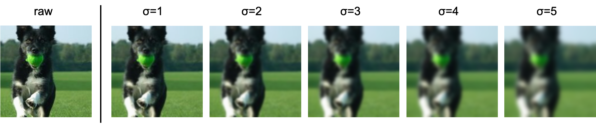
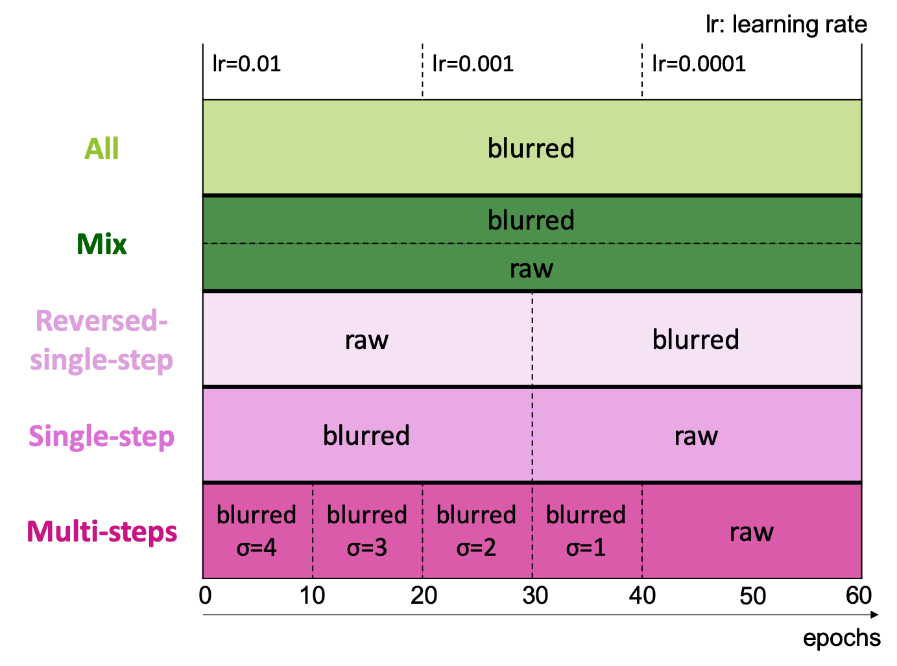

# blur-training
Training CNNs(Convolutional Neural Networks) with blurred images.

## Blurred images (GaussianBlur)
Training images are blurred by Gaussian function. The images are more blurred as std.(σ) of Gaussian kernel is bigger.

## Schedule
You can try different training schedule as for blurring images. Here is an overview of the training schedule:  
(In [`./cifar10/`][cifar10], the terms are different, and some modes may not be included.)

## Training
- `src/train_imagenet1000.py`: Training with ImageNet dataset. See [`./training_with_imagenet1000.md/`](training_with_imagenet1000.md)  
- `src/train_imagenet16.py`: Training with 16-class-ImageNet dataset. See [`./training_with_imagenet16.md/`](./training_with_imagenet16.md)  
- `./cifar10/main.py`: Training with Cifar-10 dataset. See [`./cifar10/`][cifar10]

# Datasets
(Note that you have to download ImageNet by yourself.)
- ImageNet dataset
- 16-class-ImageNet dataset 
  This dataset is from Geirhos et al., 2018.  
  (R. Geirhos, C. R. M. Temme, J. Rauber, H. H. Schütt, M. Bethge and F. A. Wichmann: Generalisation in humans and deep neural networks. Advances in Neural Information Processing Systems (NeurIPS), 7538–7550, 2018.)  
  I make the dataset from ImageNet by using `robustness` library.
- Cifar-10 dataset  

# References
[pytorch tutorial][pytorch-tutorial]  
[pytorch imagenet training example][pytorch-imagenet]

[cifar10]: ./cifar10/
[pytorch-tutorial]:https://github.com/pytorch/tutorials/blob/master/beginner_source/blitz/cifar10_tutorial.py
[pytorch-imagenet]:https://github.com/pytorch/examples/blob/master/imagenet
